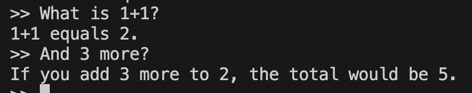
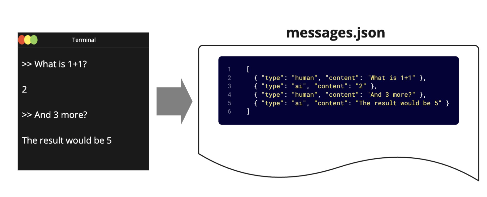
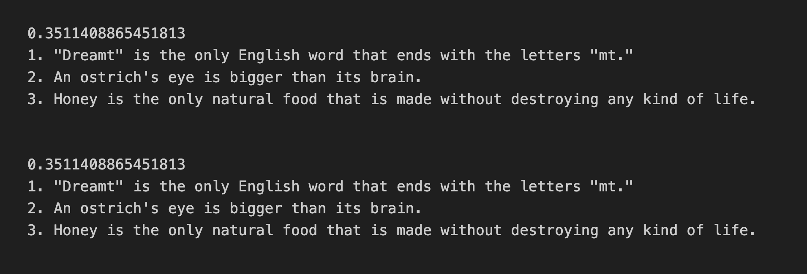

# tchat note

這裡是關於tchat專案的筆記

## Chat vs Completion Style Models 

Chat-style models (like ChatGPT, Claude) are designed for interactive, multi-turn conversations. We maintain context across messages and can engage in natural dialogue, ask follow-up questions, and adapt our responses based on the ongoing conversation.

Completion-style models are typically focused on single-turn interactions where they complete or continue a given text prompt. They're often used for tasks like:

Writing continuations of stories or articles
Generating code snippets
Completing partial sentences or paragraphs
Text transformation tasks.

## ChatGPT vs. Langchain Terminology

- System Message vs. System Message
- User Message vs. Human Message
- Asssistant Message vs. AI Message

## ChatPromptTemplate

## Memory

### Memory Results

## Saving and Extending Conversation

### Results

