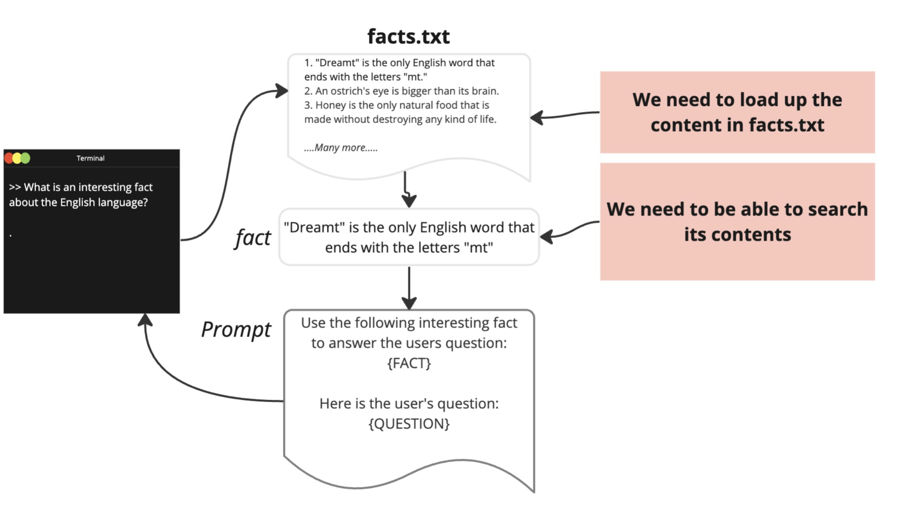
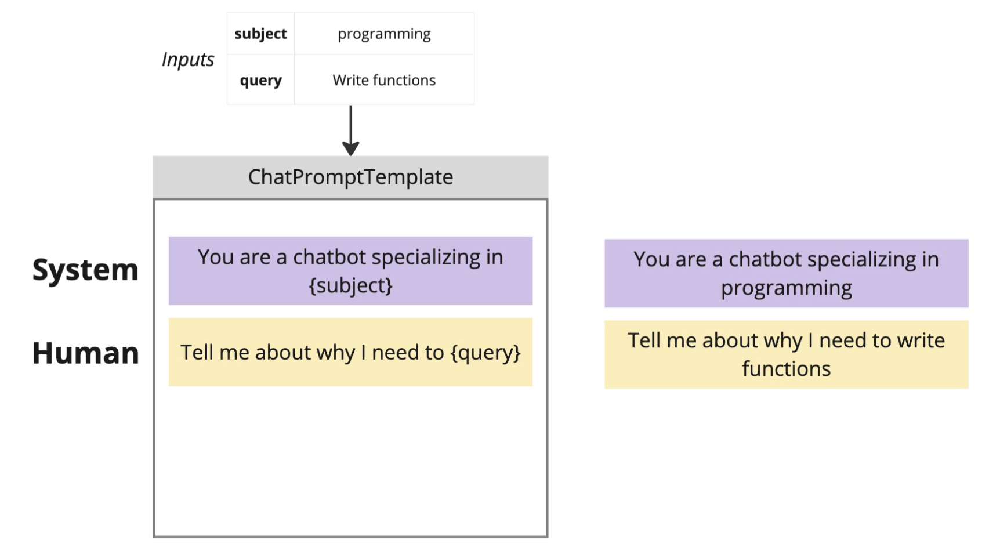
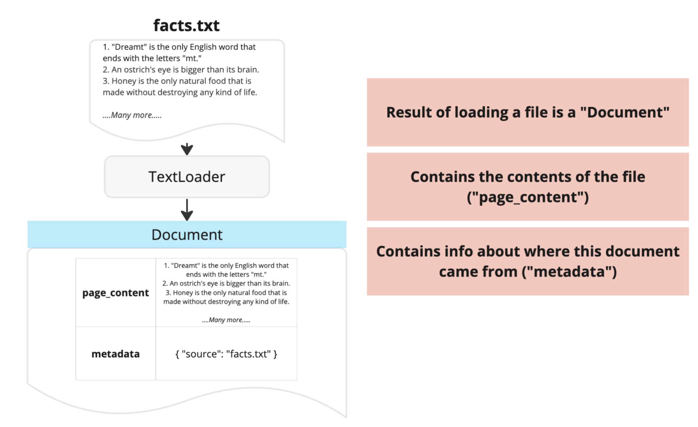
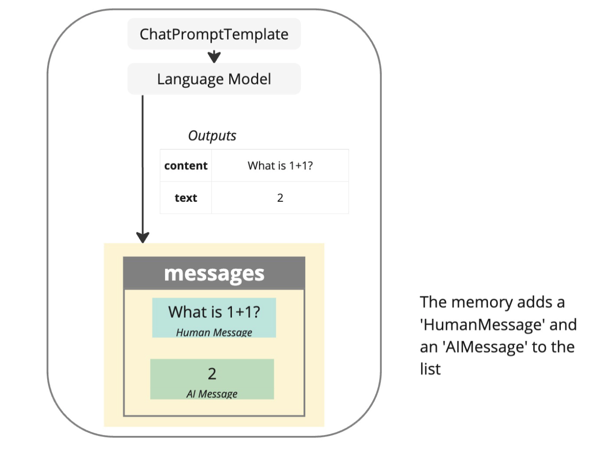
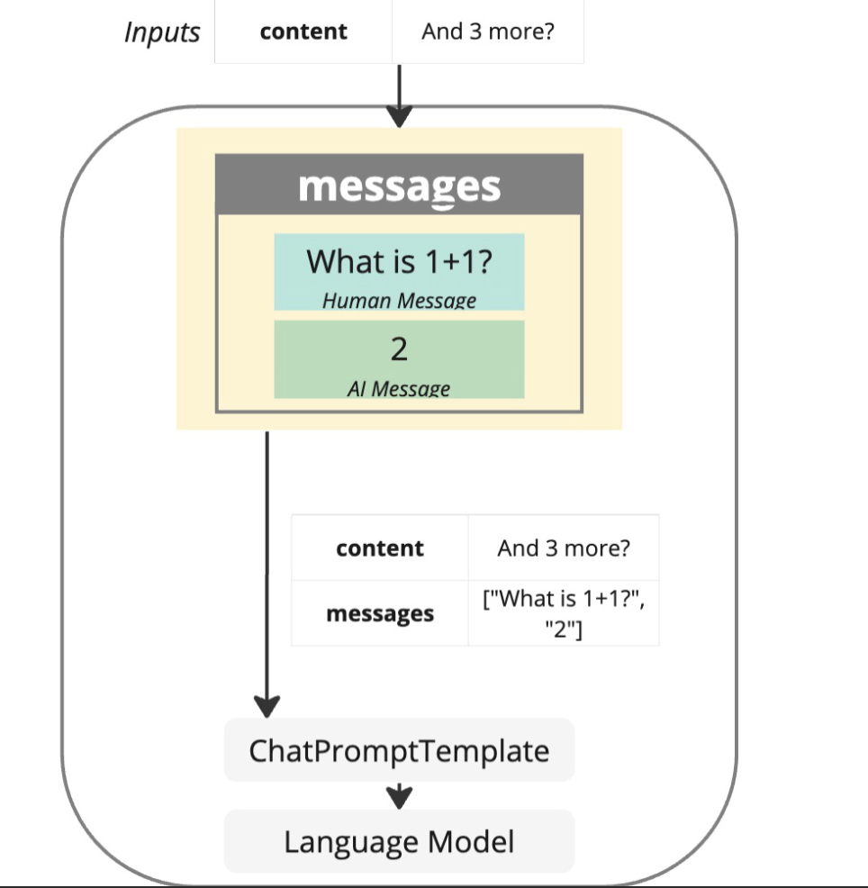
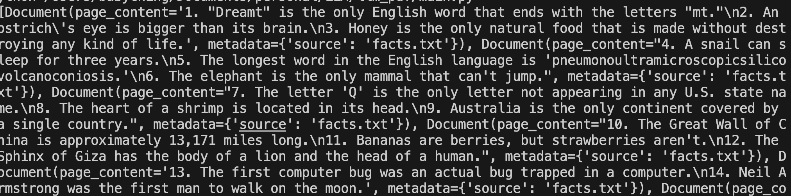

# Embedding Learning

這是一個學習如何透過langchain, 開發一個文件問答系統

## Project 目標



## 實作

### Langchain loader




### The Entire Embedding Flow




### text_splitter

```python
text_splitter = CharacterTextSplitter(
    separator="\n",
    chunk_size=200,
    chunk_overlap=0,
)
```


